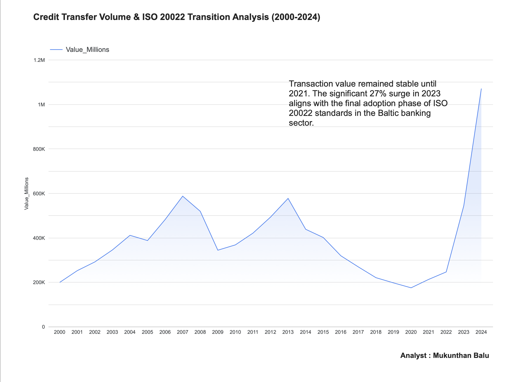

# 🇱🇻 Latvia Payment Landscape Analysis (2000–2024)
### Data Engineering & ISO 20022 Impact Study

---

## 📌 Project Overview

This project is a deep-dive into **25 years of Latvian financial infrastructure data**. Using Python and Business Intelligence tools, I mapped the full evolution of Credit Transfer activity in Latvia — tracing how the adoption of **ISO 20022 payment messaging standards** fundamentally transformed the scale and structure of the country's banking ecosystem.

The analysis spans from Latvia's early post-Soviet financial system (2000) through to the **€1 Trillion milestone** reached in 2024, connecting macroeconomic turning points to real banking infrastructure decisions.

> **Analyst:** Mukunthan Balu | ISO 20022 Certified | [LinkedIn](https://linkedin.com/in/mukunthanbalu7) | [Portfolio](https://mukunthanbalu.vercel.app)

---

## 🛠️ Technical Stack

| Layer | Tools Used |
|---|---|
| Language | Python 3.10 |
| Libraries | Pandas, NumPy |
| Environment | Google Colab |
| Data Source | European Central Bank (ECB) Statistical Data Warehouse |
| Visualization | Google Looker Studio |

---

## 📈 Key Financial Insights

### 1. The ISO 20022 Inflection Point
> A **27.27% surge in credit transfer value** was recorded in 2023 alone — directly aligning with Latvia's final transition phase to ISO 20022 messaging standards across Baltic banking infrastructure.

### 2. The €1 Trillion Milestone
> By **2024**, the total annual value of processed credit transfers in Latvia surpassed **€1 Trillion** for the first time in recorded history — a benchmark that would have been unthinkable during the plateau years.

### 3. The Decade of Stability (2013–2021)
> Transaction values remained largely flat for nearly a decade. This plateau confirms that the explosive post-2022 growth is driven by **technological modernisation** — not inflation or population growth.

### 4. Historical Volatility Context
> Two sharp peaks in **2007** and **2013** followed by steep declines reflect the global financial crisis and Latvia's subsequent austerity period — providing critical context for interpreting the current growth trajectory.

---

## 📂 Repository Structure

```
latvia-payment-analysis/
│
├── Latvia_Payment_Analysis_Clean.ipynb   # Python notebook: cleaning & transformation logic
├── latvia_data.csv                        # Raw source data from ECB
├── latvia_clean_final.csv                 # Processed, analysis-ready dataset
└── Latvia_Payment_Analysis_2024.pdf       # Executive report & final visualisation
```

---

## ⚙️ Data Pipeline

```
ECB Statistical Data Warehouse
        │
        ▼
[ Extraction ]
Raw CSV download → latvia_data.csv

        │
        ▼
[ Cleaning & Transformation ] — Python (Pandas)
• Renamed complex ECB bank codes (e.g. B010) into readable fields
• Handled null values in Growth_Pct for base year (2000 → 0%)
• Standardised date formats and column structure
• Output → latvia_clean_final.csv

        │
        ▼
[ Visualisation ] — Google Looker Studio
• 25-year time-series area chart
• Annotated ISO 20022 transition milestones
• Executive narrative overlay
• Output → Latvia_Payment_Analysis_2024.pdf
```

---

## 📊 Dashboard Preview



*Credit Transfer Volume & ISO 20022 Transition Analysis — Latvia, 2000–2024*

---

## 🔍 Data Source

**European Central Bank — Statistical Data Warehouse**
- Dataset: Payment Statistics / Credit Transfers by Value
- Coverage: Latvia (LV), Annual, 2000–2024
- Access: [ECB SDW](https://sdw.ecb.europa.eu)

> All data is publicly available and sourced directly from official ECB statistical releases.

---

## 💼 Business Relevance

This analysis was designed to mirror a real **BA/Data Analyst deliverable** in a banking or fintech environment:

- **Stakeholder framing** — findings presented as executive insights, not raw numbers
- **Regulatory context** — ISO 20022 migration tied directly to observed data patterns
- **Baltic market specificity** — focused on Latvia's unique post-Soviet financial trajectory
- **Actionable narrative** — the plateau-to-boom story is a clear signal for infrastructure investment timing

---

## 👤 About the Analyst

**Mukunthan Balu** — Junior Data/Business Analyst based in Riga, Latvia.
Certified in ISO 20022 Payment Standards and Jira Project Management.
Background in fintech compliance, HR data systems, and business operations.

🔗 [LinkedIn](https://linkedin.com/in/mukunthanbalu7) · [GitHub](https://github.com/MukunthanBalu) · [Portfolio](https://mukunthanbalu.vercel.app)
